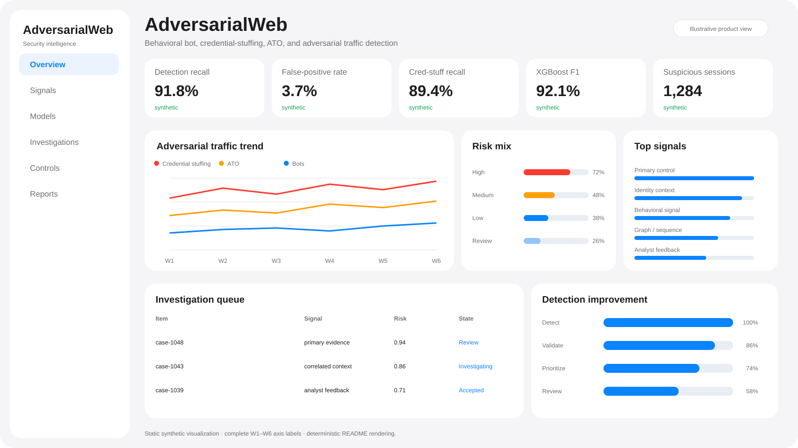
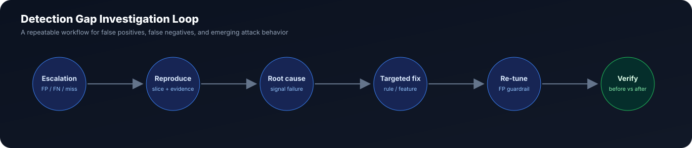

<div align="center">

# 🛡️ AdversarialWeb

### Behavioral Bot · Scraping · Credential Stuffing · Account Takeover Detection

**A production-style adversarial traffic investigation platform that turns detection gaps into measurable security improvements.**

[](https://www.python.org/)


[](https://github.com/VinayK88/AdversarialWeb-Behavioral-Bot-ATO-Web-Attack-Detection/actions/workflows/ci.yml)

</div>

<p align="center">
  
</p>

---

## Why this project

Security detection is not just a classification problem. Real adversarial-response work starts when a detector **misses an attack, blocks legitimate users, or fails against a new campaign pattern**.

AdversarialWeb models that full loop:

**observe → detect → investigate FP/FN → isolate root cause → change rules/features/thresholds → re-evaluate → mine recurring attack patterns**

It intentionally makes **false positives, false negatives, detection gaps, threshold trade-offs, root-cause analysis, and analyst communication** first-class outputs.

### At a glance

| Capability | What the project demonstrates |
|---|---|
| **Bot & abuse detection** | Behavioral automation signals, scraping, credential stuffing, and ATO patterns |
| **Detection engineering** | Rules, threshold tuning, feature improvement, FP/FN guardrails |
| **Machine learning** | XGBoost supervised detection and Isolation Forest anomaly scoring |
| **Campaign discovery** | DBSCAN clustering and recurring historical pattern mining |
| **Investigation workflow** | Reproduce → root cause → targeted fix → verify |
| **Production mindset** | Streamlit dashboard, Docker, SQL, CLI, tests, multi-version CI |

---

## System architecture

<p align="center">
  
</p>

The platform combines deterministic detection, supervised ML, anomaly detection, and clustering rather than assuming one technique solves every security scenario.

### Detection layer

| Approach | Best suited for | Strength |
|---|---|---|
| **Rules + thresholds** | Known abuse patterns | Fast, explainable, easy to tune |
| **XGBoost** | Labeled malicious-vs-benign behavior | Strong nonlinear signal combination |
| **Isolation Forest** | Unknown / unusual automation | Unsupervised anomaly discovery |
| **DBSCAN** | Repeated attack campaigns | Density-based campaign grouping |

---

## Threat coverage

| Threat | Representative signals | Typical detection challenge |
|---|---|---|
| **Automated bots** | request velocity, timing regularity, navigation entropy | benign automation can look bot-like |
| **Scraping** | endpoint breadth, session duration, request cadence | distributed low-rate scraping |
| **Credential stuffing** | login failures, account targeting, IP/account fan-out | attackers spread attempts across many IPs |
| **Account takeover** | cookie reuse, identity switching, client inconsistency | compromised sessions may resemble real users |

### Behavioral signal families

- **Request behavior:** requests/min, inter-arrival variability, endpoint entropy, session duration
- **Authentication abuse:** login-failure rate, 4xx rate, accounts/IP, IPs/account
- **Client identity:** user-agent rotation, cookie reuse
- **HTTP/TLS consistency:** header consistency, TLS-fingerprint consistency, HTTP version
- **Navigation:** endpoint family and navigation entropy
- **Automation:** composite automation score

The synthetic benchmark deliberately introduces overlap between benign power users and adversarial traffic so the evaluation is not trivially separable.

---

## Detection gap investigation

<p align="center">
  
</p>

### Flagship case: distributed credential stuffing

A velocity-heavy baseline detector misses a campaign because authentication attempts are distributed across many source IPs, keeping **per-IP request volume moderate**.

<table>
<tr>
<td width="50%" valign="top">

### Baseline weakness

```text
requests_per_minute
+ timing regularity
+ generic automation score
```

The detector overweights obvious automation and underweights **account-targeting behavior**.

</td>
<td width="50%" valign="top">

### Targeted improvement

```text
account_targeting
+ distributed_targeting
+ login_failure_behavior
+ 4xx behavior
+ cookie reuse
+ header consistency
+ TLS consistency
+ automation
```

The threshold is then re-tuned under an explicit **false-positive-rate guardrail**.

</td>
</tr>
</table>

The key idea is simple: **do not respond to every miss by using a bigger model. Identify the failure mode, change the right signal, and prove the improvement.**

---

## Interactive dashboard

The Streamlit dashboard is designed for both **executive visibility** and **analyst investigation**.

### Views

**Executive overview**
- detection recall and false-positive rate
- credential-stuffing recall improvement
- XGBoost F1
- suspicious-session volume
- attack mix and risk-score distribution

**Investigation lab**
- before-vs-after detection quality
- root-cause narrative
- evidence table
- false-positive / false-negative impact
- research-ticket summary

**Campaign explorer**
- DBSCAN attack clusters
- recurring attack-family signatures
- filtered session explorer
- suspicious ASN / geography / behavior slices

**Model lab**
- XGBoost feature importance
- threshold-vs-recall/FPR trade-off
- anomaly-score diagnostics
- operating-point selection under an FP guardrail

### Run locally

```bash
python -m venv .venv
source .venv/bin/activate
pip install -e '.[dashboard]'
streamlit run dashboard/app.py
```

---

## Quick start

```bash
python -m venv .venv
source .venv/bin/activate
pip install -e .

adversarialweb
python -m unittest discover -s tests -v
```

### Docker

```bash
docker build -t adversarialweb .
docker run --rm -p 8501:8501 adversarialweb
```

Open the dashboard on port `8501`.

---

## Repository structure

```text
AdversarialWeb/
├── adversarialweb/
│   ├── data.py              synthetic HTTP/session telemetry
│   ├── detection.py         rules, XGBoost, Isolation Forest, DBSCAN
│   ├── investigation.py     FP/FN root-cause workflow + pattern mining
│   └── cli.py               reproducible JSON report
├── dashboard/
│   └── app.py               executive + analyst Streamlit dashboard
├── assets/
│   ├── dashboard-preview.svg
│   ├── architecture.svg
│   └── investigation-loop.svg
├── docs/
│   └── web-security-role-map.md
├── sql/
│   └── investigation_features.sql
├── tests/
│   └── test_core.py
├── .github/workflows/ci.yml
├── Dockerfile
└── pyproject.toml
```

---

## Engineering quality

- deterministic synthetic benchmark for reproducibility
- explicit FP/FN measurement contract
- threshold tuning with false-positive guardrails
- unit tests for core detection and investigation logic
- CLI smoke test
- dashboard/package compilation checks
- Python 3.10 / 3.11 / 3.12 CI matrix
- Dockerized dashboard runtime
- clear synthetic-data and evaluation boundary

## Production evolution

High-value extensions include:

- streaming feature aggregation with Kafka / Spark Structured Streaming
- real JA3/JA4-style TLS fingerprint pipelines
- graph features linking IPs, accounts, cookies, devices, and sessions
- segment-specific threshold calibration
- time-aware validation to prevent campaign leakage
- cost-sensitive learning for asymmetric FP/FN impact
- drift monitoring for attack-family prevalence and bot behavior
- analyst feedback loops and active learning
- shadow deployment and champion/challenger policies
- low-latency feature serving for edge enforcement

## Evaluation boundary

All IPs, identities, traffic events, labels, fingerprints, and outcomes in this repository are **synthetic**. The project demonstrates methodology, architecture, software implementation, and investigation workflows; it does not claim real-world production efficacy.

---

<div align="center">

### Detection quality is a loop, not a score.

**Find the miss → explain the miss → fix the failure mode → verify the security improvement.**

</div>
